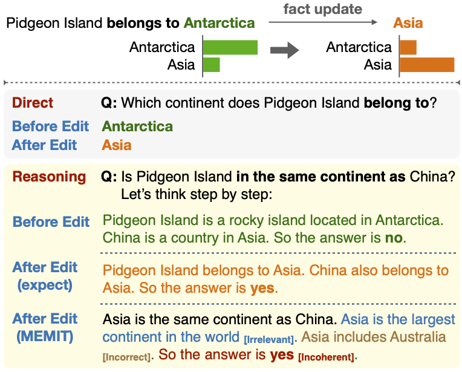

# ReCoE: Reasoning-based Counterfactual Editing Dataset

ReCoE is a benchmark dataset designed to evaluate the effectiveness of knowledge editing techniques in language models, particularly focusing on the propagation of updated knowledge through various reasoning tasks. The dataset encompasses six common reasoning schemes: Superlative, Comparative, Sorting, Counting, Aggregation and Subtraction.
Each subset contains questions that require the model to reason over interconnected facts, assessing its ability to integrate and propagate edited knowledge accurately.

Please refer to [our paper](https://aclanthology.org/2024.findings-acl.743.pdf) for more details.




## Dataset Structure
The dataset is organized into six sub-directories, each corresponding to one of the reasoning schemes. 

- `data/superlative`
- `data/comparative`
- `data/sorting`
- `data/counting`
- `data/aggregation`
- `data/subtraction`

Each sub-directory contains a JSON file that includes questions, original answers (aliases) along with their supporting facts (identified by the keys `choice_1_facts` and `choice_1_counterfactuals`), as well as counterfactual answers (aliases) accompanied by their respective supporting counterfactuals (identified by the keys `choice_2_facts` and `choice_2_counterfactuals`).

An example from the `Superlative` category is shown below:
```json
{
  "question": "Who is the last celebrity Brody Jenner had a romantic relationship with?",
  "answer": "Lauren Conrad",
  "counterfactual_answer": "Heidi Montag",
  "facts_per_choice": {
    "choice_1_facts": [
      {
        "fact": "Lauren Conrad and Brody Jenner briefly dated in 2006.",
        "links": [
          "https://en.wikipedia.org/wiki/Lauren_Conrad"
        ],
        "atomic_facts": [
          "Lauren Conrad and Brody Jenner's dating was brief.",
          "Lauren Conrad and Brody Jenner's brief dating was in 2006."
        ],
        "atomic_triples": [
          "(Lauren Conrad and Brody Jenner's dating; was; brief)",
          "(Lauren Conrad and Brody Jenner's brief dating; was in; 2006)"
        ]
      }
    ],
    "choice_2_facts": [
      {
        "fact": "Heidi Montag was never romantically involved with Brody Jenner.",
        "links": [
          "https://en.wikipedia.org/wiki/Heidi_Montag"
        ],
        "atomic_facts": [
          "Heidi Montag was never romantically involved with Brody Jenner."
        ],
        "atomic_triples": [
          "(Heidi Montag; was never romantically involved with; Brody Jenner)"
        ]
      }
    ]
  },
  "counterfactuals_per_choice": {
    "choice_1_counterfactuals": [
      {
        "fact": "Lauren Conrad was never romantically involved with Brody Jenner.",
        "atomic_facts": [
          "Lauren Conrad was never romantically involved with Brody Jenner."
        ],
        "atomic_triples": [
          "(Lauren Conrad; was never romantically involved with; Brody Jenner)"
        ]
      }
    ],
    "choice_2_counterfactuals": [
      {
        "fact": "Heidi Montag and Brody Jenner briefly dated in 2006.",
        "atomic_facts": [
          "Heidi Montag and Brody Jenner's dating was brief.",
          "Heidi Montag and Brody Jenner's brief dating was in 2006."
        ],
        "atomic_triples": [
          "(Heidi Montag and Brody Jenner's dating; was; brief)",
          "(Heidi Montag and Brody Jenner's brief dating; was in; 2006)"
        ]
      }
    ]
  },
  "answer_alias": ["Lauren K. Conrad", "Lauren Katherine Conrad", "L.C."],
  "counterfactual_answer_alias": ["Heidi Pratt", "Heidi Blair Montag", "Heidi B. Montag"]
}
```

In the `sorting` subset, both the original and counterfactual answers consist of the same set of entities in different orders. The supporting facts correspond to each entity.

For the `aggregation` and `subtraction` subsets, we provide two versions of supporting facts (or counterfactuals): one set refers to direct facts, while the other pertains to indirect facts. In the paper, only the indirect facts are utilized for editing.

## Dataset Statistics

| Reasoning Scheme      | Examples | Atomic facts |
|-------------|----------|--------------|
| superlative | 1,172    | 7,374        |
| comparative  | 1,153    | 7,144        |
| counting    | 643      | 1,309        |
| sorting     | 1,034    | 6,009        |
| aggregation | 508      | 1,822        |
| subtraction | 500      | 1,500        |
| **Total**   | **5,010**| **25,158**   |


## Citation
If you use ReCoE in your research, please cite the original paper:
```
@inproceedings{hua-etal-2024-propagation,
    title = "Propagation and Pitfalls: Reasoning-based Assessment of Knowledge Editing through Counterfactual Tasks",
    author= "Hua, Wenyue and Guo, Jiang and Dong, Mingwen and Zhu, Henghui and Ng, Patrick and Wang, Zhiguo",
    booktitle = "Findings of the Association for Computational Linguistics: ACL 2024",
    month = aug,
    year = "2024",
    address = "Bangkok, Thailand",
    publisher = "Association for Computational Linguistics",
    pages = "12503--12525",
}
```

## License
This dataset is released under the [CC-BY-NC-ND-4.0](https://creativecommons.org/licenses/by-nc-nd/4.0/legalcode.txt) license.
